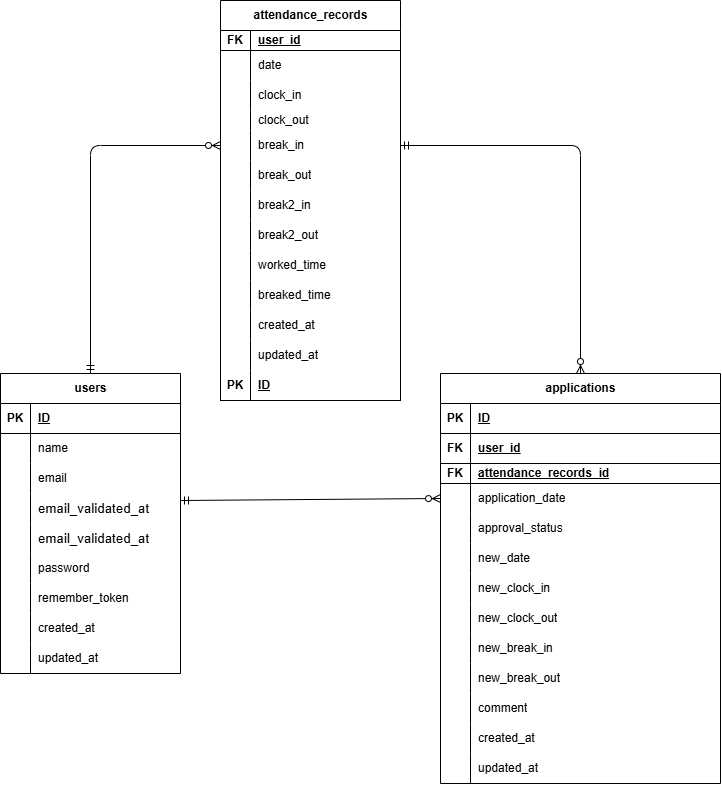

# 勤怠管理システム（WorkLog）

Laravel を用いて作成した勤怠管理アプリケーションです。  
ユーザーの出勤・退勤・休憩管理、勤怠修正申請、管理者による承認機能を備えています。

---

## 概要

- 出勤 / 退勤 / 休憩の打刻管理
- 月別の勤怠一覧表示
- 勤怠修正申請（ユーザー）
- 勤怠修正の承認フロー（管理者）
- メール認証対応（Fortify）
- 管理者・一般ユーザーの権限分離

---

## 環境構築

### Docker ビルド

```bash
git clone git@github.com:bunta27/WorkLog.git
cd WorkLog
```

※ MySQL は OS や環境によって起動しない場合があるため、必要に応じて
docker-compose.yml を各自の環境に合わせて調整してください。

### Laravel セットアップ
```bash
# host
cp .env.example .env   # できればホスト側(コンテナ外)で
docker compose up -d --build
```

#### .envの設定
```md
DB_CONNECTION=mysql
DB_HOST=mysql
DB_PORT=3306
DB_DATABASE=laravel_db
DB_USERNAME=laravel_user
DB_PASSWORD=laravel_pass
```

```bash
# container
docker compose exec php bash -lc "composer install"
docker compose exec php bash -lc "php artisan key:generate"
docker compose exec php bash -lc "php artisan migrate --seed"
docker compose exec php bash -lc "php artisan test"
```

---

## usersテーブル（ユーザー）

| カラム名 | 型 | primary key | unique key | not null | foreign key |
|---------|----|-------------|------------|----------|-------------|
| id | bigint | 〇 |  | 〇 |  |
| name | string |  |  | 〇 |  |
| email | string |  | 〇 | 〇 |  |
| password | string |  |  | 〇 |  |
| attendance_status | string |  |  | 〇 |  |
| admin_status | boolean |  |  | 〇 |  |
| email_verified_at | timestamp |  |  |  |  |
| remember_token | string |  |  |  |  |
| created_at | timestamp |  |  |  |  |
| updated_at | timestamp |  |  |  |  |

---

## attendance_recordsテーブル（勤怠）

| カラム名 | 型 | primary key | unique key | not null | foreign key |
|---------|----|-------------|------------|----------|-------------|
| id | bigint | 〇 |  | 〇 |  |
| user_id | bigint |  |  | 〇 | users(id) |
| date | date |  |  | 〇 |  |
| clock_in | datetime |  |  |  |  |
| clock_out | datetime |  |  |  |  |
| total_time | string |  |  |  |  |
| total_break_time | string |  |  |  |  |
| comment | text |  |  |  |  |
| created_at | timestamp |  |  |  |  |
| updated_at | timestamp |  |  |  |  |

---

## breaksテーブル（休憩）

| カラム名 | 型 | primary key | unique key | not null | foreign key |
|---------|----|-------------|------------|----------|-------------|
| id | bigint | 〇 |  | 〇 |  |
| attendance_record_id | bigint |  |  | 〇 | attendance_records(id) |
| break_in | time |  |  |  |  |
| break_out | time |  |  |  |  |
| created_at | timestamp |  |  |  |  |
| updated_at | timestamp |  |  |  |  |

---

## applicationsテーブル（勤怠修正申請）

| カラム名 | 型 | primary key | unique key | not null | foreign key |
|---------|----|-------------|------------|----------|-------------|
| id | bigint | 〇 |  | 〇 |  |
| user_id | bigint |  |  | 〇 | users(id) |
| attendance_record_id | bigint |  |  | 〇 | attendance_records(id) |
| approval_status | string |  |  | 〇 |  |
| application_date | date |  |  | 〇 |  |
| new_date | date |  |  | 〇 |  |
| new_clock_in | time |  |  | 〇 |  |
| new_clock_out | time |  |  |  |  |
| comment | text |  |  | 〇 |  |
| created_at | timestamp |  |  |  |  |
| updated_at | timestamp |  |  |  |  |

---

## application_breaksテーブル（修正申請・休憩）

| カラム名 | 型 | primary key | unique key | not null | foreign key |
|---------|----|-------------|------------|----------|-------------|
| id | bigint | 〇 |  | 〇 |  |
| application_id | bigint |  |  | 〇 | applications(id) |
| break_in | time |  |  | 〇 |  |
| break_out | time |  |  |  |  |
| created_at | timestamp |  |  |  |  |
| updated_at | timestamp |  |  |  |  |

---

## ログイン情報
### 一般ユーザー
ID：user1@example.com／user2@example.com／user3@example.com  
PASS：password
### 管理者
ID：admin@example.com  
PASS：password

## 使用技術（実行環境）

- PHP 8.1.34
- Laravel 8.83.29
- MySQL 8.0.26
- Docker 29.1.3/ Docker Compose v2.40.3

### URL

- 開発環境: http://localhost/
- phpMyAdmin: http://localhost:8080/
- Mailhog: http://localhost:8025/


### ER図



## 備考
### 勤怠ステータス
- 勤務外
- 出勤中
- 休憩中
- 退勤済